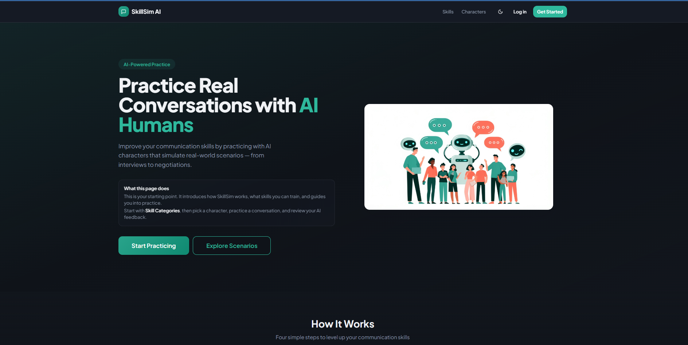
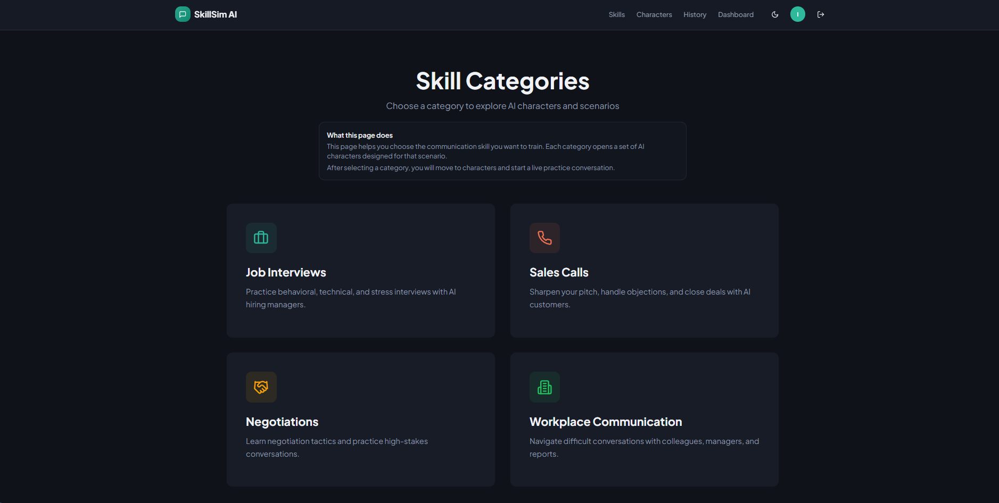
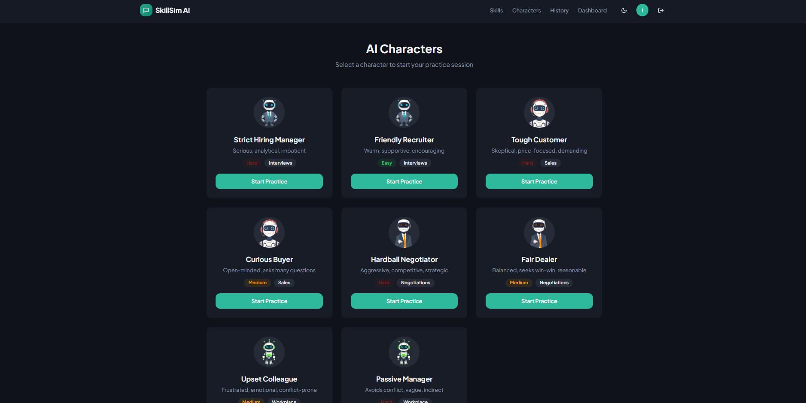
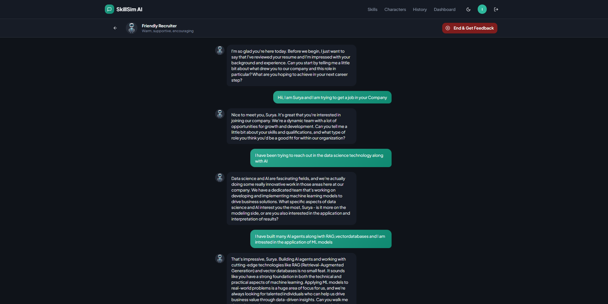
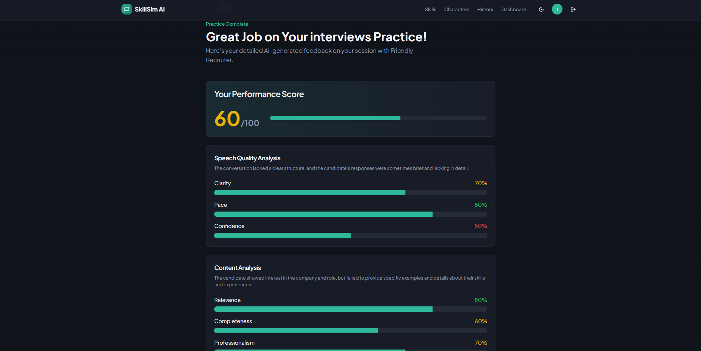
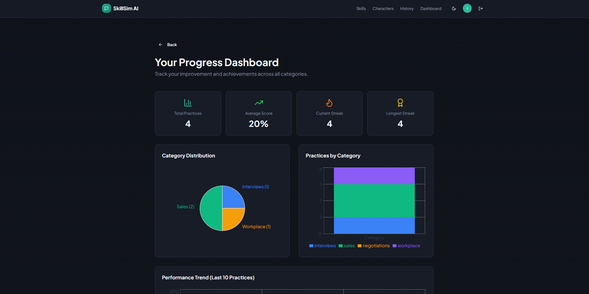

# 🎙️ SkillSim AI

A feature-rich, full-stack AI communication practice platform built with modern web technologies. Practice realistic conversations across interviews, sales, negotiation, and workplace scenarios with character-based AI roleplay, instant feedback, and progress tracking. Built with React, TypeScript, Firebase, and Tailwind CSS for a smooth, responsive experience across devices.

---

## 🎯 Overview

SkillSim AI is a modern web application built with **React**, **TypeScript**, and **Firebase** that enables users to:

- Practice real-world conversations with AI characters
- Choose communication categories based on career situations
- Get structured feedback and score breakdowns
- Track performance trends over time
- Build consistency through guided, repeatable practice sessions

The application provides a clean experience for learners while maintaining production-ready architecture for deployment.

---

## ⭐ Key Highlights

### 🎭 Character-Based Roleplay
- Category-specific characters for realistic conversations
- Personality-driven responses with dynamic AI behavior
- Multiple difficulty levels for progressive practice

### 📊 Performance & Progress Tracking
- Dashboard with overall score and trend visualization
- Completed-session statistics and history tracking
- Feedback insights to improve communication quality

### ⚡ Fast, Modern Architecture
- Vite-powered frontend for fast development/builds
- Firebase Auth + Firestore integration
- Optimized API conversation payload handling

---

## ✨ Features

### User Features

- 🔐 **Secure Authentication** - Email/Password and Google sign-in with Firebase Auth
- 🧭 **Category-Based Practice** - Interview, Sales, Negotiation, Workplace simulations
- 🎭 **Character Selection** - Personality and difficulty based AI character options
- 💬 **Live AI Conversation** - Real-time response flow for realistic practice
- 🧠 **Smart Feedback** - Actionable strengths/improvements and overall scoring
- 📈 **Progress Dashboard** - Session analytics, average score, and trend insights
- 🕘 **History Tracking** - Review past conversations and feedback sessions
- 🎨 **Responsive UI** - Mobile-friendly layout with theme support

### Technical Features

- ⚡ **Vite + React 18** - Fast refresh and optimized builds
- 🛡️ **Type Safe Codebase** - TypeScript across app logic and UI
- 🔄 **Realtime Backend** - Firebase Firestore data storage and sync
- 🧩 **Reusable UI System** - shadcn/ui + Radix primitives
- 🧪 **Testing Ready** - Vitest configured for test workflows
- ✅ **Production Friendly** - Build, lint, and deploy scripts included

---

## 🛠️ Tech Stack

### Frontend

- **React 18** - Component-driven UI architecture
- **TypeScript** - Static typing for safer development
- **Vite** - Fast development server and build system
- **Tailwind CSS** - Utility-first styling workflow
- **shadcn/ui + Radix UI** - Accessible, composable components
- **Framer Motion** - Smooth interactive animations

### Backend & Services

- **Firebase Authentication** - User login/session management
- **Cloud Firestore** - User data, progress, and conversation records
- **OpenAI-Compatible APIs** - AI responses via configurable API base/model

### Build & Tooling

- **ESLint** - Code quality enforcement
- **Vitest** - Unit test framework
- **PostCSS** - CSS processing pipeline

---

## 📁 Project Structure

```text
simulate-speak/
├── public/
│   ├── robots.txt
│   └── screenshots/
│       ├── home.png
│       ├── categories.png
│       ├── characters.png
│       ├── simulation.png
│       ├── feedback.png
│       └── dashboard.png
├── src/
│   ├── components/             # Shared components + UI primitives
│   ├── contexts/               # Auth and progress contexts
│   ├── hooks/                  # Custom hooks
│   ├── lib/                    # Firebase, AI, analytics, utility logic
│   ├── pages/                  # Route-level pages
│   ├── test/                   # Tests and setup
│   ├── types/                  # Shared TypeScript types
│   ├── App.tsx
│   ├── main.tsx
│   └── index.css
├── package.json
├── vite.config.ts
├── vitest.config.ts
├── tailwind.config.ts
└── README.md
```

---

## 🚀 Getting Started

### Prerequisites

- Node.js 18+
- npm (or bun)
- Firebase project
- OpenAI-compatible API key (Groq/OpenAI/custom)

### Installation

1. **Clone the repository**

```bash
git clone https://github.com/SuryaThejas-07/SkillSim-AI-Real-World-Conversation-Practice.git
cd simulate-speak
```

2. **Install dependencies**

```bash
npm install
```

3. **Configure environment**

Create `.env.local` (or update from `.env.example`) and set:

```env
VITE_OPENAI_API_KEY=your_api_key
VITE_OPENAI_API_BASE=https://api.groq.com/openai/v1
VITE_OPENAI_MODEL=llama-3.3-70b-versatile
```

4. **Run development server**

```bash
npm run dev
```

The app will be available at `http://localhost:5173` (or next available Vite port).

---

## 📜 Available Scripts

```bash
# Start local development server
npm run dev

# Production build
npm run build

# Development-mode build
npm run build:dev

# Preview production build locally
npm run preview

# Run tests once
npm run test

# Run tests in watch mode
npm run test:watch

# Run linting
npm run lint
```

---

## 🎬 Application Flow

### 1. Home


### 2. Categories


### 3. Characters


### 4. Simulation


### 5. Feedback


### 6. Dashboard


---

## 🔐 Security Notes

- Never commit real API keys or secrets.
- Keep `.env.local` private.
- For production, prefer server-side secret handling for third-party APIs.

---

## 🌐 Deployment

Deploy the generated `dist/` folder to:

- Vercel
- Netlify
- Firebase Hosting
- GitHub Pages

### Basic deployment flow

1. Run `npm run build`
2. Verify output using `npm run preview`
3. Deploy `dist/` to your hosting provider

---

## 🧪 Quality & Testing

- Lint with `npm run lint`
- Run tests with `npm run test`
- Use `npm run test:watch` during active development

---

## 🤝 Contributing

Contributions are welcome.

1. Fork the repository
2. Create a feature branch
3. Commit your changes
4. Push and open a pull request

---

## 📌 Project Status

- ✅ Core simulation, feedback, and progress tracking implemented
- ✅ Dashboard and history workflow integrated
- ✅ Responsive UI and theme support active
- 🔄 Ongoing improvements and feature expansion

---

**Last Updated:** March 2026
